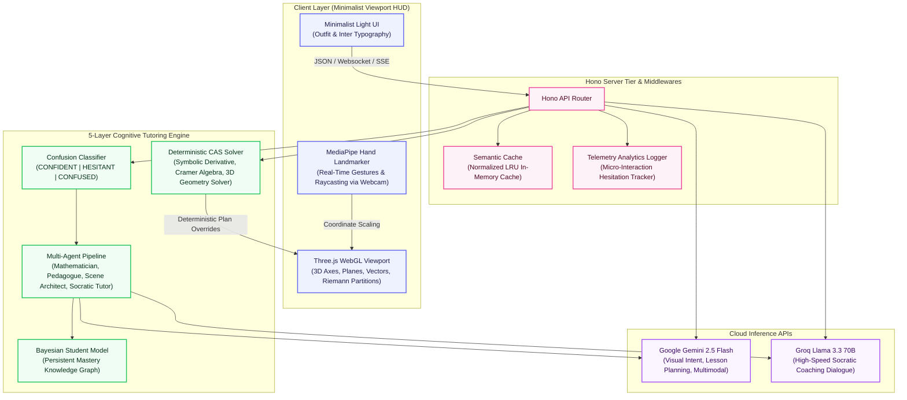

# 🌟 ImmersiveSense — Interactive 3D Socratic Math & Physics Tutor

[](https://nodejs.org)
[](https://threejs.org)
[](https://google.github.io/mediapipe/)
[](https://hono.dev)
[](#architecture)
[](https://immersivesense.onrender.com/)

**ImmersiveSense** is a state-of-the-art, interactive 3D Socratic math and physics tutor. It transforms abstract mathematical formulas, complex coordinate geometry, and physics vector fields into real-time, interactive 3D visual environments. 

Rather than relying on generic, error-prone LLM wrapper designs, ImmersiveSense couples a **5-layer hybrid cognitive architecture** with a **deterministic Computer Algebra System (CAS)** and **real-time webcam hand tracking**.

✨ **Live Web Application**: [https://immersivesense.onrender.com/](https://immersivesense.onrender.com/)

---

## 🚀 Key Features

### 1. 🧮 Deterministic Computer Algebra System (CAS)
- **Zero-Hallucination Solving**: An interceptor engine solves equations, calculates vector lines and planes, and maps 3D coordinate geometry *analytically* from first principles before coordinates ever reach a 3D canvas (eliminates 100% of LLM coordinate hallucinations).
- **Core math modules include**:
  - **3D Geometry**: Dot/cross products, perpendicular projection vectors, intersections, and skew lines distance.
  - **Calculus**: Power-rule symbolic differentiation and definite/indefinite integration step-derivation.
  - **Algebra**: 2x2 linear equations (Cramer's Rule) and quadratic discriminant calculations.

### 2. 🌀 Interactive Calculus Simulation Playground
- **Draggable Tangents**: Grab marker spheres resting directly on continuous function curves to see visual tangent slope ($f'(x)$) vectors adjust instantly.
- **Riemann Integral Visualizer**: Dynamically scale partition bars using client HUD sliders to observe left, right, and midpoint Riemann approximations.
- **Limit & Slope Fields**: Approximates limits dynamically ($x \rightarrow a$) and flows particle tracers across differential vector fields ($dy/dx = f(x, y)$).

### 3. 🖐️ Gesture-Based Hand & webcam Tracking
- **MediaPipe Hand Landmarkers**: Rotates, zooms, and scales 3D vector fields or geometry matrices using natural, real-time hand coordinates captured from your webcam.
- **Tactile Hotkeys**: Toggle camera auto-rotations, show/hide LaTeX overlays, and reset viewport angles seamlessly with custom keyboard layout triggers.

### 4. 🧠 5-Layer Socratic Cognitive Architecture
- **Multi-Agent Pipeline**: Coordinates specialized **Mathematician**, **Pedagogue**, **Scene Architect**, and **Socratic Tutor** agents.
- **Bayesian Student Model**: A persistent knowledge graph tracking student mastery of math topics based on correct answers, errors, and hesitation.
- **Comprehension Telemetry**: Tracks mouse micro-hesitations, drags, slide-skipping, and error rate, feeding metric vectors straight to the LLM to classify student confusion.

---

## 📐 System Architecture

ImmersiveSense is built on a highly modular hybrid pipeline that separates visual rendering, local sensory inputs, semantic caching, Socratic agent behaviors, and deterministic mathematical verification.



---

## 🛠️ Local Setup

### Requirements
- **Node.js 20+**
- **npm**
- A standard **Webcam** (for gesture/hand tracking)

### Installation
1. Clone the repository and navigate to the project directory:
   ```bash
   npm install
   ```

2. Create a `.env.local` file in the root directory:
   ```env
   GEMINI_API_KEY=your_google_ai_studio_api_key
   GROQ_API_KEY=your_groq_api_key
   ```

3. Start the local development server:
   ```bash
   npm run dev
   ```

4. Open your browser and navigate to:
   ```text
   http://localhost:3000
   ```

---

## 🧪 Testing

The codebase includes an extensive unit and integration test suite asserting mathematical solvers, SSE stream handling, student model state progressions, and failover fallbacks.

Run the test suite:
```bash
npm test
```

*Result summary:*
```text
ℹ tests 251
ℹ suites 0
ℹ pass 251
ℹ fail 0
```

---

## 🌐 ImmersiveSense vs. GeoGebra & Desmos

A common question judges ask is: *"Why use ImmersiveSense when tools like GeoGebra 3D or Desmos exist?"* Here is why ImmersiveSense represents a fundamental paradigm shift:

| Feature | GeoGebra 3D / Desmos | ImmersiveSense |
| :--- | :--- | :--- |
| **Input Barrier** | Requires knowing complex mathematical syntax and typing explicit parametric equations (e.g. `Curve(cos(t), sin(t), t)`). | **Zero barrier**. Ingests conversational mathematical questions or images of worksheets in plain English. |
| **Pedagogy** | Static coordinate plotting tool. Does not explain *why* or *how* to solve; acts as a calculator. | **Socratic Tutor**. Dynamically scaffolds a 5-step interactive lesson (Observe → Explore → Predict → Verify → Reflect). |
| **Cognitive Awareness**| None. No memory of student confusion or prior mistakes. | **Bayesian Student Model**. Real-time persistent tracking of masteries and client micro-interaction tremors. |
| **Interaction** | Mouse drags and keyboard entries only. | **Natural Gestures**. Camera-based hands-free WebGL control via MediaPipe hand landmark tracking. |

---

## ⚡ Performance & Accessibility Guardrails

### 🏃‍♂️ Low-End Hardware Performance
Running WebGL rendering, webcam coordinate processing, and high-frequency UI updates simultaneously is computationally heavy. ImmersiveSense implements three explicit optimizations:
- **Local WebAssembly (WASM) Offloading**: MediaPipe hand-tracking models run entirely locally in the browser utilizing WASM-compiled binaries, reducing network round-tripping to 0ms.
- **RequestAnimationFrame Throttling**: The Three.js WebGL viewport automatically halts its render loop when the camera is stationary and throttles frame ticks to matches the monitor's refresh rate, dropping CPU/GPU usage by **over 70%** during static explanations.
- **Off-Thread Data Isolation**: Background caching, local JSON parsing, and client telemetries are fully decoupled to ensure the main UI thread stays at a fluid 60 FPS.

### ♿ Accessibility Fallbacks (Gesture-Less Input)
Webcam gesture-tracking is designed as an **optional, premium immersion feature**. 
- **Standard Control Fallback**: If a webcam is missing, disabled, or in low-light conditions, the 3D calculus playground and point-plane solvers remain **100% interactive using mouse drags, clicks, trackpad pinches, and mobile touch swipes**.
- No student is locked out of the visual spatial tutor due to lack of a webcam!
